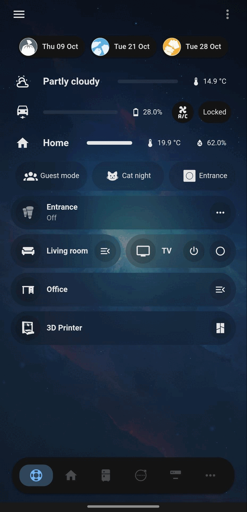
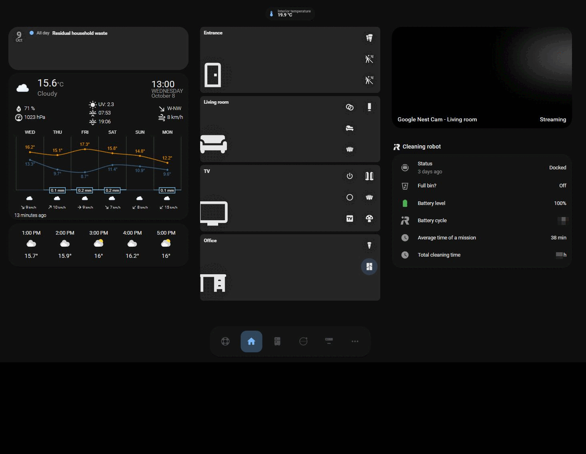

> # HomeAssistant-customisations
> 
> Home Assistant customisations and configuration base I want to share

## The project

Just a bunch of info and YAML files related to my own Home Assistant installation.

**Quick overview of how the dashboards looks like:**

* Shortcut page and `menu` > `...` expanded (shown here on mobile):

* Home, Kitchen, Car and IT pages (shown here on desktop/tablet):

### Modules

**Current HACS and Home Assistant modules installed:**

| Module name                     | Active | HA Add-on | HACS Plugin |
| :-----------------------------: | :----: | :-------: | :---------: |
| AirCast                         | Yes    | x         |             |
| Assist Microphone               | Yes    | x         |             |
| ESPHome Device Builder          | Yes    | x         |             |
| File Editor                     | Yes    | x         |             |
| Mosquitto broker                | Yes    | x         |             |
| openWakeWord                    | Yes    | x         |             |
| pigpio                          | Yes    | x         |             |
| Piper                           | Yes    | x         |             |
| Samba share                     | Yes    | x         |             |
| Speech-to-Phrase                | Yes    | x         |             |
| System Monitor                  | Yes    | x         |             |
| Terminal & SSH                  | **No** | x         |             |
| Volvo                           | Yes    | x         |             |
| Volvo2Mqtt                      | **No** | x         |             |
| Alexa Media Player              | Yes    |           | x           |
| Bambu Lab                       | Yes    |           | x           |
| Big Slider Card                 | Yes    |           | x           |
| Bubble Card                     | Yes    |           | x           |
| card-mod                        | Yes    |           | x           |
| Custom brand icons              | Yes    |           | x           |
| Decluttering Card               | Yes    |           | x           |
| Default Dashboard               | Yes    |           | x           |
| fold-entity-row                 | Yes    |           | x           |
| HACS                            | Yes    |           | x           |
| Home Assistant Swipe Navigation | Yes    |           | x           |
| Material You Theme              | Yes    |           | x           |
| Material You Utilities          | Yes    |           | x           |
| mini-graph-card                 | Yes    |           | x           |
| Mushroom                        | Yes    |           | x           |
| Navbard card                    | Yes    |           | x           |
| RecycleApp                      | Yes    |           | x           |
| UI Lovelace Minimalist          | Yes    |           | x           |
| Weather Chart Card              | Yes    |           | x           |

**Specifically for Bubble Card:**

Submodules have been installed to further enhance the _bubble card_ module:

* [Frosted Glass](https://github.com/Clooos/Bubble-Card/discussions/1672)
* [Room Card](https://github.com/Clooos/Bubble-Card/discussions/1700)
* [Icon Border Progress](https://github.com/Clooos/Bubble-Card/discussions/1525)
* [Customize the icon color (by Dimi27)](https://github.com/Clooos/Bubble-Card/discussions/1514)

**Add-on repositories:**

Some HA add-ons are installed from external repositories, outside of HACS:

* [HassOS Configurator (GitHub)](https://github.com/adamoutler/HassOSConfigurator) - for _'HassOS I2C Configurator'_, used to enable Raspberry Pi I2C bus. Once enabled, no need to keep it anymore.
* [Poeschl Home Assistant Add-ons (GitHub)](https://github.com/Poeschl-HomeAssistant-Addons/repository) - for _'pigpio'_
* [volvo2mqtt (GitHub)](https://github.com/Dielee/volvo2mqtt) - for _'Volvo2Mqtt'_

## Built with

